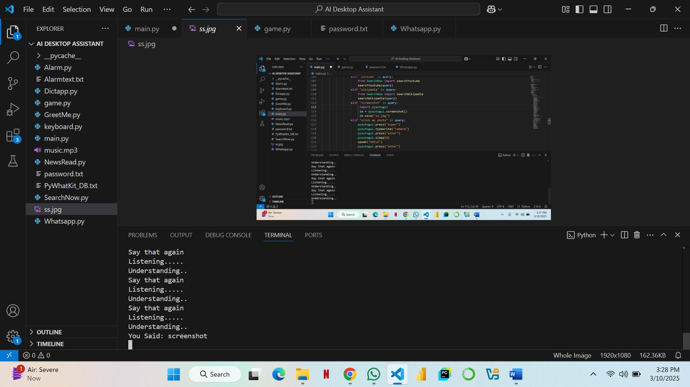

# 🤖 AI Desktop Assistant (Python)

A voice-controlled desktop assistant built with Python. It can perform tasks like searching Google, opening websites and apps, telling the time, and more — all through voice commands.

## 🚀 Features

- 🎤 Voice recognition using SpeechRecognition
- 🗣 Text-to-speech (TTS) using pyttsx3
- 🌐 Web search, Wikipedia summaries
- 📂 Open local applications/files
- 🕒 Time and date response
- 🧠 Optional: ChatGPT/OpenAI integration

## 🛠 Tech Stack

- Python 3.x
- `speech_recognition`
- `pyttsx3`
- `wikipedia`
- `webbrowser`
- `datetime`
- `os`
- `pyautogui`
- 


## 🖥️ Screenshots

| Assistant Ready | Speaking Response |
|------------------|------------------|
|  | 


## 🔧 Setup Instructions

1. Clone the repo:
   ```bash
   git clone https://github.com/yourusername/ai-desktop-assistant.git
   cd ai-desktop-assistant
pip install -r requirements.txt
pyttsx3
speechrecognition
wikipedia
webbrowser
pyaudio
datetime

Run the assistant:


#run 

python main.py


mail: alishanpansota49@gmail.com
linkedin: https://www.linkedin.com/in/ali-shan-pansota-7018521b9/?utm_source=share&utm_campaign=share_via&utm_content=profile&utm_medium=android_app


